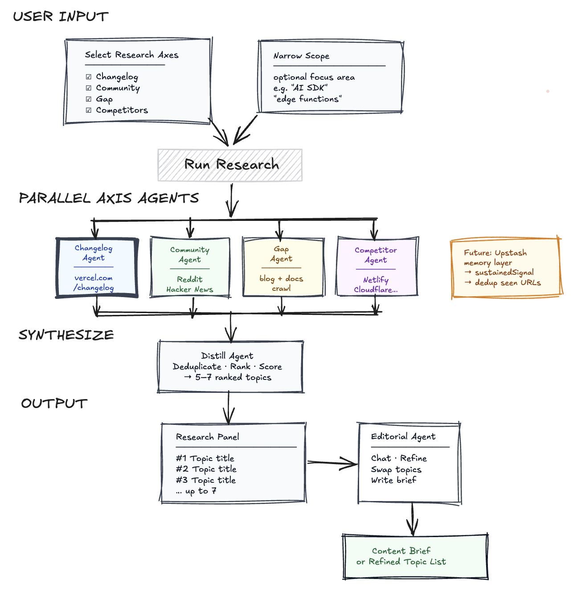
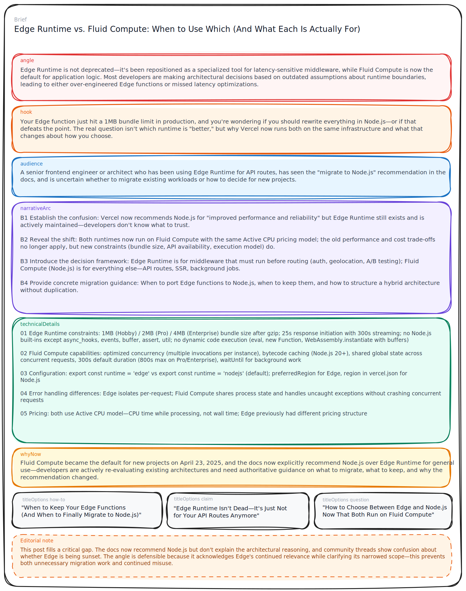

# Content Radar — Editorial Engine

An AI-powered content ideation tool for editorial and thought leadership teams. It runs a configurable set of research axes in parallel, synthesizes the results into a ranked shortlist of content opportunities, and opens a chat interface where an editorial agent helps the team decide what to write, sharpen angles, and generate ready-to-execute briefs.

The engine is designed to be adapted per client: the axes, agent instructions, competitor sets, source URLs, and editorial voice all live in agent files and are swapped out per branch.

---

**Origin**

This started as a side project while I was evaluating whether to host my portfolio on Vercel instead of Cloudflare. Exploring Vercel's platform led me to think seriously about expanding my writing scope beyond the deeply engineering-grounded work I usually do and into more opinionated, creative tech marketing territory.

My question was: how do you make good editorial choices at the start of a pipeline, before a single word is written? My builder-ish instinct kicked in. I wanted a system that could surface content opportunities from multiple signals: community conversations, competitor coverage, feature releases, content gaps. Rank them. Generate a thorough brief for each one. Good enough to hand to a writer, or to a sufficiently capable agent.


---

## Contents

- [How it works](#how-it-works)
- [Getting started locally](#getting-started-locally)
- [Deployment](#deployment)
- [Environment variables](#environment-variables)
- [Architecture](#architecture)
- [Project structure](#project-structure)
- [Adapting to a new client](#adapting-to-a-new-client)
- [Future extensions](#future-extensions)
- [Troubleshooting](#troubleshooting)

---

## How it works

1. **Research** — four specialist agents run concurrently, each probing a different signal source:
   - A **changelog axis** — scans `vercel.com/changelog` for releases that deserve a dedicated blog post, not just a release note
   - A **community axis** — surfaces developer pain points, questions, and organic excitement from Reddit and Hacker News
   - A **competitors axis** — audits deployment platforms (Netlify, Cloudflare, Railway) and AI-native builders (Lovable, GitHub) for topics Vercel hasn't covered
   - A **gap axis** — scans `vercel.com/blog` and `vercel.com/docs` for undercovered or missing topics

2. **Synthesis** — a distill agent deduplicates and ranks the combined signals into the top 7 content opportunities

3. **Editorial chat** — an agent grounded in the client's editorial voice, methodology, and audience helps the team elaborate on topics, reorder by priority, and generate full content briefs

Each research run streams progress back to the UI via Server-Sent Events so per-axis status and agent steps are visible in real time.



Once research completes, click any topic to generate a ready-to-execute brief:



---

## Getting started locally

```bash
# 1. Fork this repo on GitHub, then clone your fork
git clone https://github.com/your-org/editorial-engine.git
cd editorial-engine

# 2. Install dependencies
npm install

# 4. Set up environment variables
cp .env.example .env.local             # if an example file exists, otherwise create .env.local manually
# Fill in AI_GATEWAY_API_KEY, MODEL_ID, TAVILY_API_KEY
# (see Environment variables section below — Upstash vars are not required for this version)

# 5. Start the dev server
npm run dev
```

Open [http://localhost:3000](http://localhost:3000). Enter a focus area (optional) and click **Run** to trigger a research cycle.

> **Vercel project linked?** Skip step 4 and pull variables directly:
> ```bash
> vercel link
> vercel env pull .env.local
> ```

**Other commands:**

```bash
npm run build   # production build
npm run start   # start production server
npm run lint    # run ESLint
```

---

## Deployment

The project deploys to Vercel. Extended function timeouts are configured in `vercel.json` (research-heavy agents use up to 300 s for axes and synthesis; lighter ones use 30 s).

```bash
npm i -g vercel   # install Vercel CLI if needed
vercel link       # link to project (first time)
vercel            # deploy to preview
vercel --prod     # deploy to production
```

`@mastra/*` packages are marked as `serverExternalPackages` in `next.config.ts` so they resolve correctly in the Vercel Node.js runtime.

---

## Environment variables

Set these in your Vercel project settings or in a local `.env.local` file:

| Variable | Description |
|---|---|
| `AI_GATEWAY_API_KEY` | Vercel AI Gateway API key. All agents route through `https://ai-gateway.vercel.sh/v1`. Not needed on Vercel deployments — the platform injects an OIDC token automatically. Required locally. |
| `MODEL_ID` | Model identifier passed to the gateway. Format: `creator/model-name` (e.g. `moonshotai/kimi-k2.5`, `anthropic/claude-sonnet-4-6`). Swapping the model requires only this env var change — no code changes. |
| `TAVILY_API_KEY` | [Tavily](https://tavily.com) API key. Used by agents that run web searches. |
| `UPSTASH_REDIS_REST_URL` | **Not required for this version.** Reserved for the incremental enrichment feature (see [Upstash incremental enrichment](#upstash-incremental-enrichment)). Auto-set when provisioned via the Vercel Marketplace. |
| `UPSTASH_REDIS_REST_TOKEN` | **Not required for this version.** Reserved for the incremental enrichment feature (see [Upstash incremental enrichment](#upstash-incremental-enrichment)). Auto-set when provisioned via the Vercel Marketplace. |
| `TRACE_ENABLED` | Optional. Set to `true` to log tool call details and agent steps to the console. |

Pull them locally once the project is linked:

```bash
vercel env pull .env.local
```

---

## Architecture

**Stack:** Next.js App Router, Mastra (agent orchestration), Vercel AI SDK, Vercel AI Gateway. Tavily powers web search inside the axis agents. Zod defines and validates all structured outputs (`TopicSignal`, `RankedTopic`, and `Brief`), enforcing shape at the boundary between agent free-text and typed application state. Note for a later stateful version: Redis (Upstash) is provisioned for incremental enrichment across runs (see [Future extensions](#future-extensions)).

Request flow from client to agents:

```
page.tsx (client)
│
├── ResearchPanel — axis selection, run trigger, live SSE progress, topic list
└── ChatPanel — useChat / editorial agent conversation
    │
    ├── POST /api/axis/{axis-name}  ← streams SSE per axis
    │   Each route: specialist agent (Mastra) → raw findings → distillAgent → TopicSignal[]
    │
    ├── POST /api/synthesize   ← distillAgent ranks + deduplicates → RankedTopic[0..7]
    │
    ├── POST /api/brief        ← editorialAgent generates a structured Brief object
    │
    └── POST /api/chat         ← editorialAgent conversational turn (AI SDK useChat)
```

Each axis route streams the following SSE event types:

| Event | When |
|---|---|
| `tool_call` | A tool was invoked (name + input visible) |
| `tool_done` | Tool result returned |
| `distilling` | Agent loop complete, distillation pass starting |
| `done` | Axis complete — structured `TopicSignal[]` attached |
| `error` | Axis failed — stream closes, other axes continue |

**Agents:**

| Agent | Role |
|---|---|
| `changelogAgent`, `communityAgent`, `competitorsAgent`, `gapAgent` | One per axis. Each fetches and processes a specific signal source. |
| `distillAgent` | Converts raw research text into structured `TopicSignal[]` JSON. Called by every axis route and by `/api/synthesize`. |
| `editorialAgent` | Handles chat turns, topic elaboration, reordering, and brief generation. Grounded in the client's voice and methodology. |

All agents use the Vercel AI Gateway via `@ai-sdk/openai`. Mastra is the orchestration layer — TypeScript-native, built on the Vercel AI SDK, with first-class Next.js and `useChat` integration.

**Key data types** (defined in `src/lib/types.ts`):
- **`TopicSignal`** — raw signal from a single axis: `title`, `rationale`, `axis`, `audience`, `contentType`, `sources`, optional `competitorTier`
- **`RankedTopic`** — `TopicSignal` extended with `rank` (1–7) and `sustainedSignal` (appeared in 2+ axes)
- **`Brief`** — full content brief: `angle`, `hook`, `audience`, `narrativeArc` (4 beats), `technicalDetails`, `whyNow`, `titleOptions` (3), `callToAction`, `seoKeywords`, `competitorGap`

> **Two-call pattern:** tools and structured output cannot run in the same `agent.generate()` call on most models. Every axis route uses Call A (agent + tools → `result.text`) followed by Call B (`distillAgent` + Zod schema → typed output). Proper separation: agents explore, distillation structures.

---

## Project structure

```
src/
├── app/
│   ├── api/
│   │   ├── axis/
│   │   │   └── {axis-name}/route.ts   — one route per configured axis
│   │   ├── synthesize/route.ts
│   │   ├── brief/route.ts
│   │   └── chat/route.ts
│   ├── globals.css
│   ├── layout.tsx
│   └── page.tsx
├── components/
│   ├── AxisBadge.tsx       — axis label chip
│   ├── ChatPanel.tsx       — editorial chat interface
│   ├── LoadingState.tsx    — per-axis status + SSE event log; owns ALL_AXES
│   ├── ResearchPanel.tsx   — left panel: run controls, topic list, brief trigger
│   └── TopicCard.tsx       — ranked topic display card
├── lib/
│   ├── apiError.ts         — shared error response helper
│   ├── emitter.ts          — SSE emit helper used inside axis routes
│   ├── parseJson.ts        — safe JSON extraction from LLM output
│   ├── tavily.ts           — Tavily client singleton
│   ├── trace.ts            — lightweight console tracing
│   └── types.ts            — Zod schemas: TopicSignal, RankedTopic, Brief
└── mastra/
    ├── agents/             — one file per agent; all client-specific content lives here
    ├── tools/
    │   ├── fetchUrl.ts         — fetches a URL and returns text content
    │   ├── searchCommunity.ts  — Tavily search scoped to community sources
    │   └── searchCompetitor.ts — Tavily search scoped to competitor domains
    └── index.ts            — Mastra instance + Redis singleton
```

**Design tokens** (`src/app/globals.css` and `src/app/layout.tsx`): background `#ffffff`, foreground `#171717`, Geist Sans (body), Geist Mono (code), Caveat 400/600 (handwritten annotations). Tailwind CSS v4 with `@tailwindcss/typography`.

---

## Adapting to a new client

The engine is designed to be forked and repointed. All client-specific content lives in agent files — nothing bleeds into the shared infrastructure.

This repo is grounded in Vercel's editorial context: the `editorialAgent` is benchmarked against published posts like "Turbopack, the Successor to Webpack" and "Partial Prerendering: Building Towards a New Default Rendering Model," and the competitor set covers deployment platforms (Netlify, Cloudflare, Railway) and AI-native builders (Lovable, GitHub). Swap those out and you have a different engine entirely.

Minimum changes for a new adaptation:

1. **Agent instructions** — update each agent file in `src/mastra/agents/` with the target editorial voice, audience profile, competitor set, and source URLs
2. **Axes** — add or remove axis routes in `src/app/api/axis/` and update `ALL_AXES` in `src/components/LoadingState.tsx`
3. **`editorialAgent`** — the most important file. It drives chat and brief generation. Ground it in specific methodology, terminology, and content benchmarks.
4. **`layout.tsx`** — update the page title and description
5. **`vercel.json`** — adjust `maxDuration` to match expected agent run times

---

## Future extensions

These are scoped but not yet built.

### Upstash incremental enrichment

Currently each research run starts from scratch. Upstash is provisioned but axes do not read or write state, and `sustainedSignal` is hardcoded to `false` on all topics.

The intended behavior: each axis does a delta pass — what is new since the last run — and leaves the store richer than it found it. `sustainedSignal: true` marks topics that persist across multiple runs, indicating durable editorial opportunity rather than a one-time spike.

Upstash key schema per axis:

| Key | Type | Purpose |
|---|---|---|
| `axis:changelog:lastTimestamp` | string | Cursor for changelog delta passes |
| `axis:community:threads` | JSON array | Thread IDs + decay scores |
| `axis:gap:publishedIndex` | JSON array | Published content index, append-only |
| `axis:competitors:cursors` | JSON object | Per-competitor fetch cursors |
| `synthesis:topicList` | JSON array | Ranked topic list from the last run |

Implementation note: `Redis.fromEnv()` reads `UPSTASH_REDIS_REST_URL` + `UPSTASH_REDIS_REST_TOKEN` automatically. Read before Call A, write after Call B. Never write on failure so the cursor stays at last successful position.

### Performance feedback loop

Performance data should inform **how to write**, not **what to write**. Topic selection stays editorially driven by the four-axis research. Past performance (Vercel Analytics, Search Console) is injected into brief generation only — teaching the system about tone, depth, format, and angle style based on what has resonated — without contaminating synthesis ranking.

Technical path: performance patterns stored in Upstash as craft heuristics, injected into the brief generation system prompt as context.

### Draft triage

Extend the same agent to prioritize an existing backlog of drafts by publish-readiness and strategic value. Input: array of draft objects (title, summary, date created) from Notion or a Google Drive folder. Output: prioritized queue with a per-draft assessment. Requires a `/api/triage` route — same two-call pattern as axis routes.

---

## Troubleshooting

| Symptom | Likely cause | Fix |
|---|---|---|
| `Redis.fromEnv()` error locally | Upstash vars set but empty or malformed | These vars are not required for the current version — remove them from `.env.local` if present, or provision Upstash via the Vercel Marketplace for the incremental enrichment path |
| Axis route 500 | Tavily key missing or invalid | Check `.env.local` → `TAVILY_API_KEY` |
| Gateway auth error | `AI_GATEWAY_API_KEY` wrong or absent | Regenerate in Vercel dashboard → AI Gateway → API Keys |
| Route timeout locally | Slow Tavily fetch on cold start | Retry once; try `vercel dev` for closer prod parity |
| `structuredOutput` returns wrong shape | Tools and structured output in the same call | Confirm the two-call pattern — Call A uses tools, Call B has no tools |
| Chat not streaming | AI SDK version mismatch in chat route | Confirm `version: "v6"` in `handleChatStream` matches the installed `ai` package |
| Build fails on Vercel | Mastra not externalized | Confirm `serverExternalPackages: ["@mastra/*"]` in `next.config.ts` |
| `MODEL_ID` gateway error | Wrong model string format | Format must be `creator/model-name` — check available models at `vercel.com/ai-gateway/models` |

